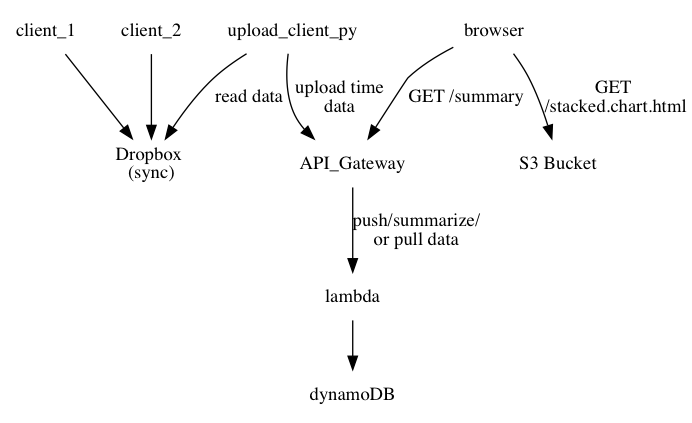

</img>

### Table of Concents
1. [What](#what)
2. [Input data](#input-data)
3. [Output example](#output-example)
4. [Architecture overview](#architecture-overview)
4. [Can I use this?](#can-i-use-this)

### What
This is a simple time tracker [lambda](https://aws.amazon.com/lambda/) and [DynamoDB](https://aws.amazon.com/dynamodb/) based service, built as a project to learn [clojure](https://www.braveclojure.com/) and micro services. The initial inspiration came from reading the book [168 Hours](https://lauravanderkam.com/books/168-hours/), in which Laura Vanderkam asks us to really see what we are doing with our time. There are 168 hours in a week and her claim is that although we feel we never have enough time, journaling what we do is a means to bullshit test ourselves.

### Input data
* We split our time between `personal` and `work` universes.
* _(Actually this project doesnt care how you divide your life, but the first term, below, is a "core-category" )_
* ...
* And furthermore we bring our attention to either specific *Projects*, which have a beginning and an end, such as the below `taxes-2017`--_hopefully one day I will finish my taxes_--and `adhoc` tasks which is meant to record time spent helping a colleague for example (here called `consulting`, below). 
* `routine` is a potentially useful --_or not_-- distinction of things we do which do not have an *End*.
```
times 2018-02-10

10:00 - 10:30 ; personal ; taxes-2017 ; plan ; just starting out
10:30 - 11:05 ; personal ; routine ; yoga
11:35 - 12:20 ; work ; WRK-345-bugfix-foo ; code
12:20 - 13:05 ; work ; adhoc ; consulting 
13:05 - 13:35 ;  work ; WRK-345-bugfix-foo ; code
```

### Output example

* Here is an example of an output stacked area chart of a `core-category:work` query, which is using the author's data from December of 2017. This uses the d3js so called _stacked_ layout. The _y-axis_ represents minutes.
* This chart is not labeled, but it is possible to see that some days in the week of _December 4th_ had multiple competing interests, while the week of _Dec 11th_ there was a bit more focus on the _Purple project_.

* This particular layout only allows for a max of `20` layers before colors are re-used for other categories.
* [a lot can be said](http://leebyron.com/streamgraph/stackedgraphs_byron_wattenberg.pdf) about stacked area chart aesthetics.

### Architecture overview
Here's a super simple overview. There are several lambdas at play here, but the general picture looks like this.



* Here, `crontab -l` shows how an upload script runs every 20 minutes
```
# crontab -l

*/20 * * * * bash /path/to/my/local/repo/timesheet-parser/clojure-time/timeparse.upload.sh
```
* and the `timeparse.upload.sh` is a one liner that does...
```bash
sh -c 'source /local/path/to/my/environmental/variables.sh  \
  && source /local/path/to/my/python/environment/thing/bin/activate \
  && python /path/to/my/local/repo/timesheet-parser/scripts/upload_client.py  times /local/path/to/my/Dropbox/my/dir/with/time/data'

```

### Can I use this?
This service has not yet been neatly templatized for easy adoption.
This for now has been a fun side project proof of concept for helping _the author_ figure out where his time is going.

Productionizing would happen of course given enough of a demand.
